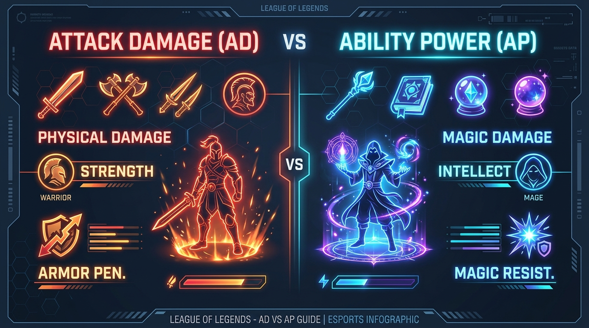
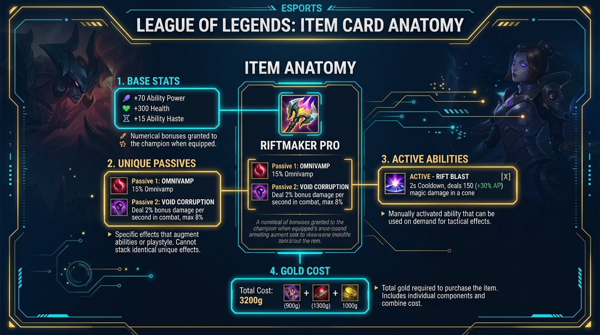
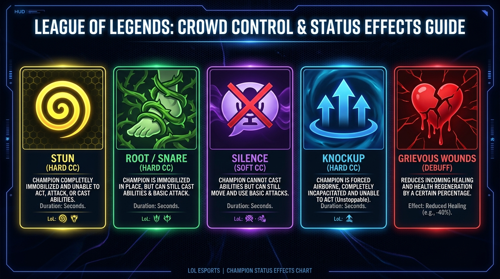
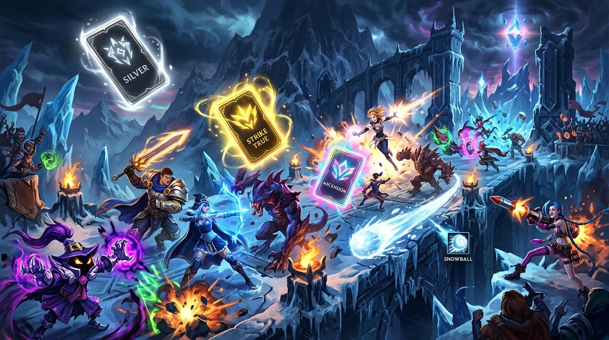

# 🎮 League of Legends - Cours 101 ARAM & ARAM: MAYHEM

[](https://eune.leagueoflegends.com/)
[](#-sommaire-du-cours)
[](#-g%C3%A9n%C3%A9ration-du-pdf-en-local)
[](index.html)
[](LICENSE)

Un guide complet, pédagogique et visuellement travaillé pour enseigner League of Legends à un ami débutant, spécialement conçu pour les joueurs de **ARAM (All Random All Mid)** et du mode spécial **ARAM: MAYHEM**.

---

## 📸 Aperçu des Infographies HD Intégrées

| Infographie | Sujet & Description |
| :--- | :--- |
|  | **AD (Dégâts Physiques / Orange) vs AP (Puissance Magique / Bleu)**<br>Explication des ratios, des couleurs de compétences et des contrés (Armure vs RM). |
|  | **Anatomie des Objets**<br>Comment lire une fiche d'objet (Stats brutes, Passifs Uniques automatiques et Effets Actifs manuels). |
|  | **Guide des Altérations d'État (CC)**<br>Différence entre Stun, Root, Silence, Knockup (incassable par Purge/Ténacité) et Grievous Wounds (-40% soins). |
|  | **ARAM: MAYHEM & Optimisations**<br>Le guide du chaos : Augments Argent, Or et Prismatiques, Objets Prismatiques et synergies déjantées. |

---

## 📜 Sommaire du Cours

1. **[Introduction & Mentalité ARAM](index.html#introduction)**
   - Les 4 règles d'or (No Back, Achat à la mort, Portails Hextech, Snowball/Marquage).
   - Gestion de l'or et timing de mort stratégique.
2. **[AD vs AP & Types de Dégâts](index.html#ad-vs-ap)**
   - Distinguer les dégâts AD, AP et Bruts (True Damage).
   - Comment identifier si une compétence demande de l'AD ou de l'AP.
3. **[Le Dictionnaire Complet des Statistiques](index.html#statistiques)**
   - Vitesse d'Attaque & Coup Critique.
   - Hâte de compétence (Ability Haste / CDR).
   - Léthalité vs Pénétration d'Armure en %.
   - Vol de Vie, Vampirisme Physique & Omnivamp.
   - L'effet Anti-Soin : **Hémorragie (Grievous Wounds)**.
4. **[Anatomie des Objets (Passifs vs Actifs)](index.html#objets)**
   - Effets automatiques vs Boutons à presser (raccourcis 1-6).
   - Règle d'or sur les Passifs Nommés (Unique Passives).
5. **[Altérations d'État & Contrôles de Foule (CC)](index.html#cc-status)**
   - Hard CC vs Soft CC.
   - Pourquoi le Knockup est le roi des CC.
   - Rôle et fonctionnement de la Ténacité.
6. **[Spécial ARAM: MAYHEM](index.html#aram-mayhem)**
   - Comprendre le système d'Augments (Argent, Or, Prismatique).
   - Synergies avec les Objets Prismatiques.

---

## 🔍 Mots-clés & Thématiques SEO (Search Engine Optimization)

- **Mots-clés principaux :** `League of Legends`, `Guide LoL débutant 101`, `ARAM Mayhem`, `AD vs AP LoL`, `Vol de vie vs Omnivamp`, `Knockup Ténacité`, `Objets passifs et actifs LoL`, `Hémorragie Grievous Wounds`.
- **Balisage sémantique :** HTML5 (`<header>`, `<nav>`, `<main>`, `<article>`, `<section>`, `<footer>`), métadonnées Open Graph & Twitter Cards, microdonnées JSON-LD Schema.org (`Course`, `FAQPage`).

---

## 🚀 Génération du PDF en Local

Ce dépôt inclut une page web HTML/CSS moderne avec un thème esport sombre, ainsi qu'un script Node.js automatisé avec `puppeteer-core` pour compiler le guide en un fichier PDF haute résolution A4.

### Prérequis
- [Node.js](https://nodejs.org/) (v16+)
- Microsoft Edge ou Google Chrome installé sur votre machine.

### Installation & Compilation PDF

```bash
# 1. Cloner le dépôt
git clone https://github.com/ArthureCodage/lol-aram-101-guide.git
cd lol-aram-101-guide

# 2. Installer les dépendances
npm install

# 3. Générer le fichier PDF
npm run build:pdf
```

Le fichier PDF sera automatiquement créé à la racine du projet sous le nom :  
📁 `League_of_Legends_ARAM_101_Guide.pdf`

---

## 📂 Structure du Dépôt

```
lol-aram-101-guide/
├── assets/
│   ├── lol_stats_ad_ap.jpg
│   ├── lol_item_anatomy.jpg
│   ├── lol_status_cc_guide.jpg
│   └── lol_aram_mayhem_banner.jpg
├── index.html                           # Cours complet au format HTML/CSS (SEO Ready)
├── sitemap.xml                          # Sitemap XML pour Google / Bing
├── robots.txt                           # Fichier d'instructions robots de recherche
├── generate_pdf.js                      # Script de compilation PDF via Puppeteer/Edge
├── League_of_Legends_ARAM_101_Guide.pdf # Document PDF final compilé
├── package.json
├── .gitignore
├── LICENSE
└── README.md
```

---

## 📄 Licence

Ce projet est sous licence MIT - Voir le fichier [LICENSE](LICENSE) pour plus de détails.
